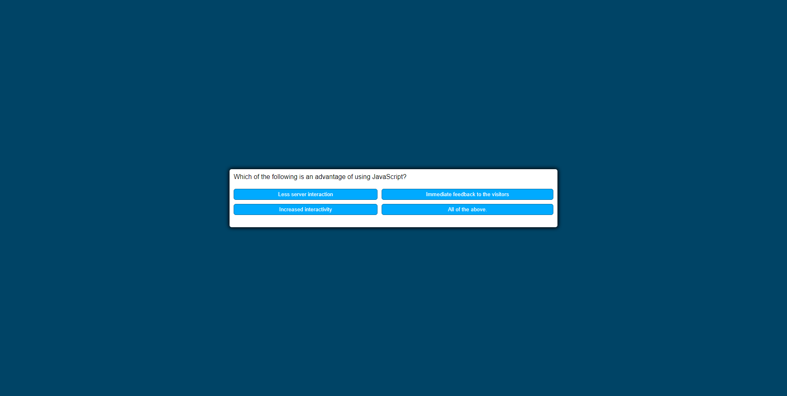

# My_JavaScript_Quiz
https://antoniom4.github.io/My_JavaScript_Quiz/
Making a JavaScript quiz for a fellow classmate
Provide a short description explaining the what, why, and how of your project. Use the following questions as a guide:
- We wanted a quiz to test our JavaScript Knowlegdge
- I learned how a working program flows and how it should be set up 
## Usage
Provide instructions and examples for use. Include screenshots as needed.
To add a screenshot, create an `assets/images` folder in your repository and upload your screenshot to it. Then, using the relative filepath, add it to your README using the following syntax:
    ```md
    
    ```
## Credits
## License
## Badges
## Features
timer, multiple choice selection, background changes based on answers